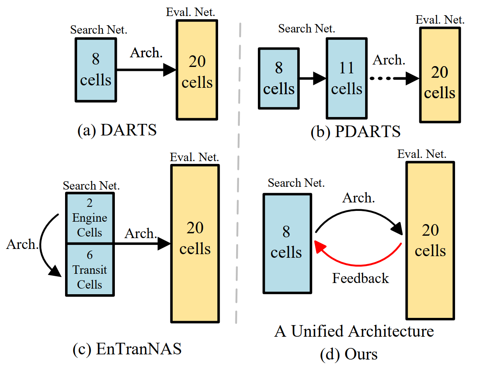

# Cyclic Differentiable Architecture Search

**This is an official implementation of CDARTS**

In this work, we propose new joint optimization objectives and a novel Cyclic Differentiable ARchiTecture Search framework, dubbed CDARTS. Considering the structure difference, CDARTS builds a cyclic feedback mechanism between the search and evaluation networks with introspective distillation. First, the search network generates an initial architecture for evaluation, and the weights of the evaluation network are optimized. Second, the architecture weights in the search network are further optimized by the label supervision in classification, as well as the regularization from the evaluation network through feature distillation. Repeating the above cycle results in a joint optimization of the search and evaluation networks and thus enables the evolution of the architecture to fit the final evaluation network.

<div align="center">
    
</div>

## Environment Setup

Tesla V100, CUDA10.0, linux 16.04, pytorch>=1.2, python3, [apex](https://github.com/NVIDIA/apex)

### Data Preparation
* [Cifar-10](https://www.cs.toronto.edu/~kriz/cifar.html)
* [Cifar-100](https://www.cs.toronto.edu/~kriz/cifar.html)
* [ImageNet-2012](http://www.image-net.org/)

Create soft link in main dir.
```
ln -s $DataLocation experiments/data
```
In ${ROOT}/experiments/data, it should be like this.
```
experiments/data/imagenet/train
experiments/data/imagenet/val
...
```

### Installation
* First, you should install graphviz.
     ```
     apt-get install graphviz
     ```
* Install python requirements.
    ```buildoutcfg
    pip install -r requirements
    ```
* Then you should install apex.
    ```buildoutcfg
    git clone https://github.com/NVIDIA/apex
    cd apex
    python setup.py install --cpp_ext --cuda_ext
    ```

### Search, Retrain and Evaluation
We have provided all the shell scripts and the corresponding default parameters, which are stored in the scripts folder.
* For example:
    ```buildoutcfg
    cd ${CODE_ROOT}
  
    bash CyDAS/scripts/run_search_cifar_1gpu.sh
    bash CyDAS/scripts/run_retrain_cifar_1gpu.sh
    ...
    ```

#### Search
* Main python file is 
    ```buildoutcfg
    ${ROOT}/CyDAS/search.py
    ```
* Followings are options during training.
    ```buildoutcfg
    --regular                   # whether to use regular
    --regular_ratio             # if use regular, the ragular ratio
    --regular_coeff             # if use regular, the regular coefficient
    --ensemble_param            # Ensemble different layer features
    --loss_alpha                # the loss coefficient
    --w_lr                      # the learning rate of the search network
    --alpha_lr                  # the learning rate of the architecture parameters
    --nasnet_lr                 # the learning rate of the evaluation network
    --w_weight_decay            # the weight decay the search and the evaluation network
    --alpha_weight_decay        # the weight decay the the architecture parameters
    --fix_head                  # wheter to fix the paramters of auxiliary heads
    --interactive_type          # The KD function, 0 kl, 1 cosine, 2 mse, 3 sl1
    --pretrain_epochs           # the pretrain epochs of the search network
    --search_iter               # the search iterations
    --search_iter_epochs        # the epochs in each search iteration
    --nasnet_warmup             # the epochs used to train a new evaluation network
    ```
* Here we present our search scripts on CIFAR and ImageNet.
    ```buildoutcfg
    bash CyDAS/scripts/run_search_cifar_1gpu.sh
    bash CyDAS/scripts/run_search_cifar_4gpus.sh
    bash CyDAS/scripts/run_search_imagenet.sh
    ```
* Modify the following settings in `run_search_cifar_1gpu.sh` and `run_search_cifar_4gpus.sh` to search on CIFAR100.
    ```
    --dataset cifar100
    --n_classes 100
    ```

#### Retrain
* Main python file is 
    ```buildoutcfg
    ${ROOT}/CyDAS/retrain.py
    ```
* We have provided all cell genotypes of Cifar and ImageNet in 
    ```buildoutcfg
    ${ROOT}/CyDAS/cells/cifar_genotypes.json
    ...
    ```
* Followings are options during training.
    ```buildoutcfg
    --cell_file                 # path of cell genotype
    --weight_decay              # decay of W in the Retrain-Phase
    --lr                        # learning rate of W in the Retrain-Phase
    --warmup_epochs             # warmup epochs 
    --epochs                    # total retrain epochs 
    --cutout_length             # cutout length for cifar
    --aux_weight                # weight of auxiliary loss, 0.4 is the best option   
    --drop_path_prob            # used for dropping path in NAS
    --label_smooth              # label smooth ratio
    ```
* Here we present our train scripts on CIFAR and ImageNet.
    ```buildoutcfg
    bash CyDAS/scripts/run_retrain_cifar_1gpu.sh
    bash CyDAS/scripts/run_retrain_cifar_4gpus.sh
    bash CyDAS/scripts/run_retrain_imagenet.sh
    ```
* Modify the following settings in `run_retrain_cifar.sh` to train CIFAR100.
    ```
    --dataset cifar100
    --n_classes 100
    ```

#### Evaluation
* Main python file is 
    ```buildoutcfg
    ${ROOT}/CyDAS/test.py
    ```
* Followings are options during testing.
    ```buildoutcfg
    --resume                   # whether to load checkpint
    --resume_name              # checkpint name
    ```
* Here we present our test scripts on CIFAR and ImageNet.
    ```buildoutcfg
    bash CyDAS/scripts/run_test_cifar.sh
    bash CyDAS/scripts/run_test_imagenet.sh
    ```
* Modify the following settings in `run_test_cifar.sh` to test CIFAR100.
    ```
    --dataset cifar100
    --n_classes 100
    ```

## Model Zoo
For evaluation, we provide the checkpoints and configs of our models in [Google Drive](https://drive.google.com/drive/folders/1CkFp24bEDq0wUp504BQ68jn5Vs069qox?usp=sharing).

After downloading the models, you can do the evaluation following the description in *Evaluation*).

Model download links:

### DARTS Search Space
#### CIFAR10
| Top-1 Acc. %       | 97.60                                                                                              | 97.45                                                                                              | 97.52                                                                                              | 97.53                                                                                              | 97.54                                                                                              | 97.77                                                                                              |
|--------------------|----------------------------------------------------------------------------------------------------|----------------------------------------------------------------------------------------------------|----------------------------------------------------------------------------------------------------|----------------------------------------------------------------------------------------------------|----------------------------------------------------------------------------------------------------|----------------------------------------------------------------------------------------------------|
| Cell Download link | [Cell-1](https://drive.google.com/file/d/1mlRQUo2DyiZvwfhVfkcjJRAaaxJLmkjs/view?usp=sharing) | [Cell-2](https://drive.google.com/file/d/1W-2uvAQZVTuWEDHEhvb_FHv_US9Pl6tS/view?usp=sharing) | [Cell-3](https://drive.google.com/file/d/12j6SwGAfE4_eKIBr38PSy9pyxMG_9avB/view?usp=sharing) | [Cell-4](https://drive.google.com/file/d/1muuQLTxFX7oKAd8hjsxwOzRx1hGYsCjP/view?usp=sharing) | [Cell-5](https://drive.google.com/file/d/1eBJjEldqfo3AsfPT5wemI46PdhtgQh5i/view?usp=sharing) | [Cell-6](https://drive.google.com/file/d/1nZ1XNOAb325-UZN-rbs17fzLfjKrhd-S/view?usp=sharing) |

#### ImageNet
| Top-1 Acc. %       | 75.90                                                                                              | 75.93                                                                                              | 76.40                                                                                              | 76.60                                                                                              | 76.44                                                                                              |
|--------------------|----------------------------------------------------------------------------------------------------|----------------------------------------------------------------------------------------------------|----------------------------------------------------------------------------------------------------|----------------------------------------------------------------------------------------------------|----------------------------------------------------------------------------------------------------|
| Cell Download link | [Cell-1](https://drive.google.com/file/d/1VY8MyWaDbrWQdi4xyKEcaX88ndH_o9XP/view?usp=sharing) | [Cell-2](https://drive.google.com/file/d/1nokqF1HaPrKbW0vkeN3mB9M5mHRI745U/view?usp=sharing) | [Cell-3](https://drive.google.com/file/d/1Rk8JbHAUUG5pE4t3AU94yfIsPsE5GTJH/view?usp=sharing) | [Cell-4](https://drive.google.com/file/d/1fgQk3o4svX8hoP__MK2qikokrDpn9rx7/view?usp=sharing) | [Cell-5](https://drive.google.com/file/d/12_TG4F0cnHc9lmsRiKK7TiN5CsyncBkx/view?usp=sharing) |

### NATS-Bench
| Model | CIFAR10 Validation | CIFAR10 Test | CIFAR100 Validation | CIFAR100 Test | ImageNet-16-120 Validation | ImageNet-16-120 Test | Download link |
|-------|--------------------|--------------|---------------------|---------------|----------------------------|----------------------|---------------|
| Cell1 | 91.50%             | 94.37%       | 73.31%              | 73.09%        | 45.59%                     | 46.33%               | [Cell, Log](https://drive.google.com/file/d/13CpMr1V-S0d8C2WbIHwSzApmdBInKn0U/view?usp=sharing)             |
| Cell2 | 91.37%             | 94.09%       | 72.64%              | 72.57%        | 45.46%                     | 45.63%               | [Cell, Log](https://drive.google.com/file/d/1Gbnm61NbYmEkdW6YCBUWDA_sQGtm83vR/view?usp=sharing)             |
| Cell3 | 90.51%             | 93.62%       | 70.43               | 70.10%        | 44.23%                     | 44.57%               | [Cell, Log](https://drive.google.com/file/d/1zq2Eg8IZt5MVXFnmKuuCDS5bei-ENlWw/view?usp=sharing)             |

### Chain-structured Search Space

Model | Params. | Flops | Top-1 Acc. % | Download link 
--- |:---:|:---:|:---:|:---:
CDARTS-a | 7.0M | 294M | 77.4 | [Model, Config, Log](https://drive.google.com/drive/folders/146h42gj9yNhmOoJX87hTeHw5PvOIyGPi?usp=sharing)
CDARTS-b  | 6.4M | 394M | 78.2 | [Model, Config, Log](https://drive.google.com/drive/folders/1LUY9dfLIGSQicfoInHaffIepunujyuGe?usp=sharing)

### Object Detection
Backbone            | Input Size  | Params. | Flops | AP    | AP\_50 | AP\_75 | AP\_S | AP\_M | AP\_L | Download link
----------------------- | --------- | -------- | ----- | ----- | ------ | ------ | ----- | ----- | ----- | ---
CDARTS-a | 1280x800 |  6.0G  | 7.0M  | 35.2 | 55.5 | 37.5  | 19.8 | 38.7 | 47.5 | [Model, Config, Log](https://drive.google.com/drive/folders/1xkV_ZJXhHPkDbL1Ogc3AQJvi9HC1Egyn?usp=sharing)
CDARTS-b | 1280x800 |  8.1G  | 6.4M  | 36.2 | 56.7 | 38.3  | 20.9 | 39.8 | 48.5 | [Model, Config, Log](https://drive.google.com/drive/folders/1xkV_ZJXhHPkDbL1Ogc3AQJvi9HC1Egyn?usp=sharing)


### Semantic Segmentation
| Dataset    | Encoder  | Input Size  | Params. | Flops | mIoU % | Download link |
|------------|----------|-------------|---------|-------|--------|---------------|
| Cityscapes | CDARTS-b | 1024x2048 | 5.9M    | 20.7G | 78.1 | [Model,Config,Log](https://drive.google.com/drive/folders/1MO_hgwWcUf1c1OFYO-6Rit6IA-3fMKAO?usp=sharing) |
| ADE20K     | CDARTS-b | 640x640   | 2.7M    | 5.9G  | 40.4 | [Model,Config,Log](https://drive.google.com/drive/folders/1OJyNLkMMK1IIu1F3USrkNsa9BeLlGiUp?usp=sharing) |


## Bibtex

If this repo is helpful for you, please consider to cite it. Thank you! :)
```bibtex
@article{CDARTS,
  title={Cyclic Differentiable Architecture Search},
  author={Yu, Hongyuan and Peng, Houwen and Huang, Yan and Fu, Jianlong and Du, Hao and Wang, Liang and Ling, Haibin},
  booktitle={IEEE Transactions on Pattern Analysis and Machine Intelligence (TPAMI)},
  year={2022}
}
```